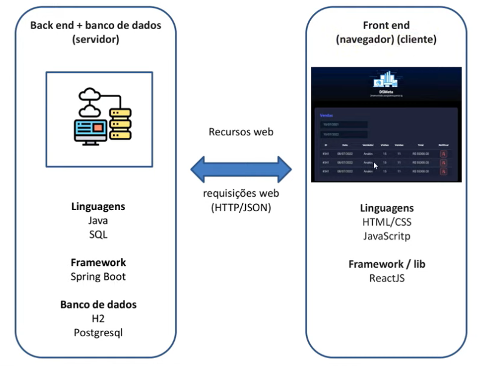
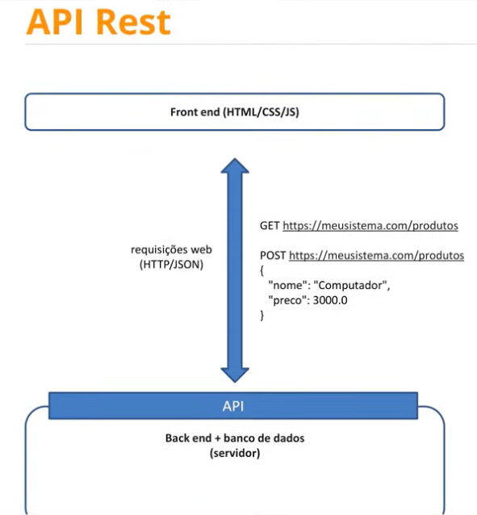
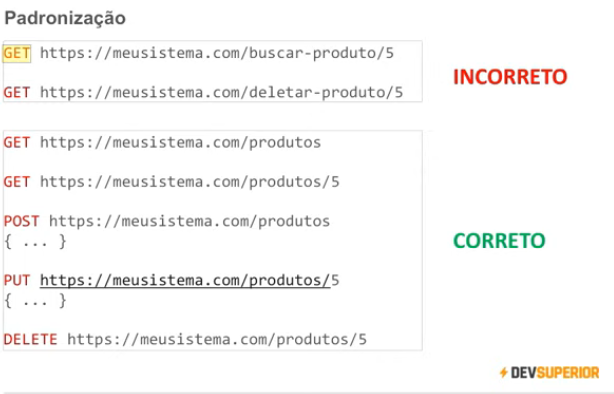
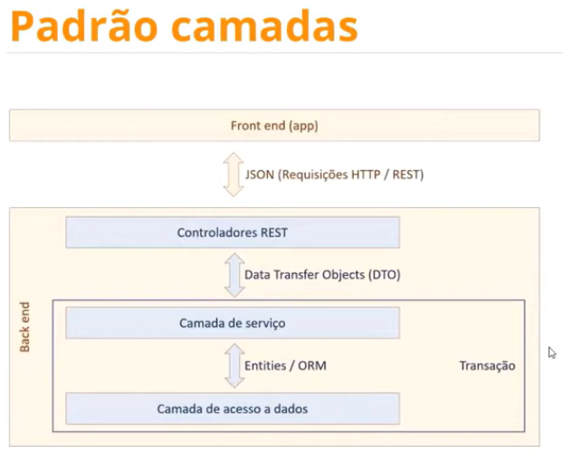

<h1> API REST

Padrão REST

* Cliente/ Servidor com HTTP
* Comunicação stateless (*)
* Interface uniforme, formato padronizado (*)
* Cache
* Sistemas em camadas
* Código sob demanda (opcional)

https://www.redhat.com.br/pt-br/topics/api/what-is-a-rest-api

<h1> Padrão camadas

